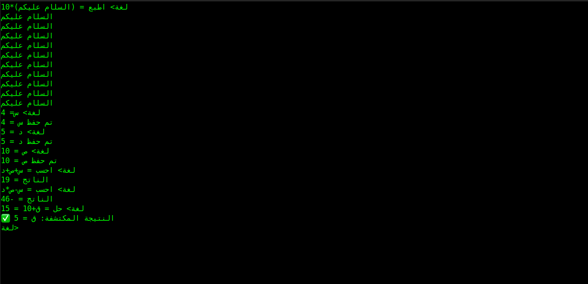

# اللغة البرمجية العربية (Arabic Programming Language) 🚀

==============================================###############============================================################=================================================

الرخصة : GLP v2
المشروع : لغة برمجة عربية
اسم المشروع : اللغة البرمجية العربية
المطور : مطور (العرب)
الاصدار : 1 الاول
النوع : لعة برمجة (مترجم لغة)
=============================================###############=======############## هيكل المشروع(شرح_تفصيلي)


مرحباً بك في مشروع **اللغة البرمجية العربية**، وهو مفسر (Interpreter) متكامل مصمم بلغة **C** لتمكين المبرمجين من كتابة الأكواد والعمليات الحسابية والبرمجية باللغة العربية الفصحى وبأسلوب بسيط ومباشر.

## 🏗 فلسفة وهيكل المشروع
يعتمد المشروع على بنية "المحركات المستقلة" لضمان أداء عالٍ وسهولة في التطوير:


* **المشغل الرئيسي (`المشغل_الرئيسي.c`)**: نقطة الانطلاق وإدارة العملية البرمجية.
* **محرك الإشارات**: المسؤول عن استقبال الأوامر وتوجيهها.
* **مفسر العمليات**: تحليل وفهم الأوامر (مثل: اطبع، احسب).
* **المحرك الرياضي**: وحدة متطورة لحل المعادلات (الأسس، الجيب، فاي).
* **محرك الدوال**: إدارة كتل الكود المستقلة والتحكم في نطاق العمليات.

## 🛠 الأوامر الأساسية
تم اختزال العمليات المعقدة في أوامر عربية واضحة:
* `اطبع = [نص]` : لطباعة النصوص.
* `احسب = [معادلة]` : لحل العمليات الرياضية.
* `نفذ = [أمر]` : لتنفيذ أوامر نظام التشغيل (مثل `ls`).
* `نظف` : لمسح الشاشة.
* `خروج` : لإغلاق بيئة العمل.

## 📝 أمثلة تطبيقية

### 1️⃣ الحساب والمتغيرات
تستطيع اللغة التعامل مع المتغيرات والثوابت الرياضية بدقة عالية:
```text
لغة> س = 10
لغة> ص = 5
لغة> احسب = س + ص + 20
الناتج = 35
